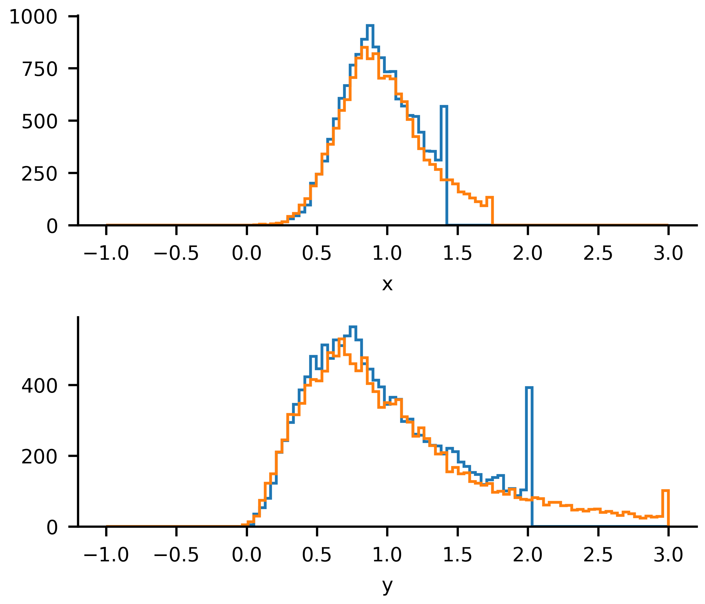

# Sticky bounds issue

This is just a temporary repository to demonstrate a sticky-bounds issue with CMA.

Steps to reproduce:

```bash
git clone git@github.com:tovrstra/cma-bounds-issue.git
cd cma-bounds-issue
python -m venv venv
source venv/bin/activate
pip install --upgrade pip
pip install -r requirements.txt
pre-commit install
python bounds.py
python plot.py
```

The script `bounds.py` takes about 120 minutes to complete.
It performs many CMA optimizations on the same surface, ...

The histograms of solutions are plotted by the last script.
These plots reveal a large number of solutions coinciding with the bounds.
When he bounds are extended, a similar accumulation appears at the new bounds
and dissapaers from the original bounds.



For convenience, this repository includes NPY files with CMA solutions and
the PNG showig the histogram.
